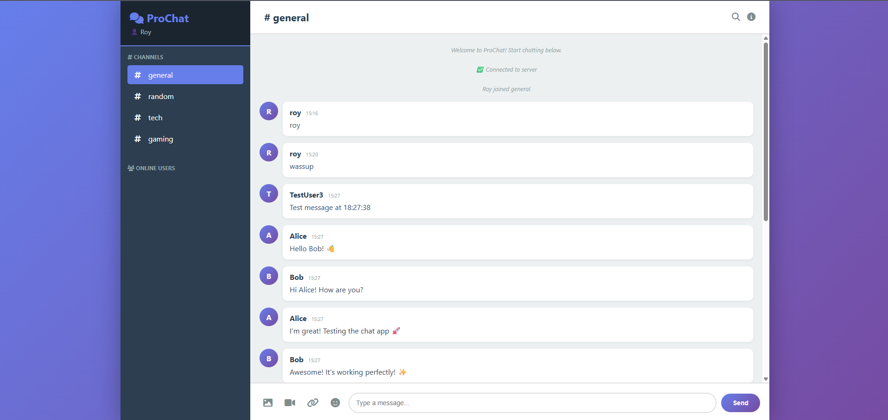

 💬 Instant Messaging Made Simple: Meet ProChat

Building a real-time chat application is often seen as a "Right of Passage" for developers. It touches on so many critical concepts: WebSockets, asynchronous events, database persistence, and containerization. 

Today, I want to share ProChat (DockerChat), a project that takes this concept to the next level. It's not just a "Hello World" chat app; it's a fully functional, professional-grade communication tool that you can spin up in seconds thanks to Docker.



 🚀 Why This Project?

Most chat tutorials stop at "sending a message." ProChat aims to be something you'd actually want to use. We focused on:

- Ease of Deployment: If you have Docker, you have the app. No `requirements.txt` hell, no database setup scripts.
- User Experience: A modern, dark-themed UI that feels responsive and alive.
- Feature Completeness: Channels, private DMs, media support, and persistent history.

 ✨ Key Features

Here is what makes ProChat stand out:

 1. Real-Time Communication
Using Flask-Socket.IO, messages are delivered instantly (< 100ms latency). Whether you are in the same room or connecting over the internet, the chat flows naturally without refreshing the page.

 2. Multi-Channel & Private Messaging
Users can hop between topic-based channels (`general`, `tech`, `gaming`) or slide into DMs for private 1-on-1 conversations. The UI clearly separates these contexts, keeping your conversations organized.

 3. Rich Media Support
Text is boring! ProChat supports:
- Emojis: A built-in picker with 100+ emojis.
- Images & Videos: Drag, drop, and share media directly in the chat.
- Links: URLs are automatically detected and clickable.

 4. Smart Persistence
We use SQLite with Docker Volumes to ensure your data is safe. Restart the container? Your messages are still there. It's the perfect balance of simplicity and reliability for a self-hosted app.

 🛠️ The Tech Stack

We stuck to a robust, Python-centric stack:

- Backend: Python 3.11 with Flask 2.3.3
- Real-Time Engine: Socket.IO with Eventlet for high-concurrency handling.
- Database: SQLAlchemy ORM with SQLite.
- Frontend: Vanilla JS (ES6+), HTML5, and CSS3. No heavy frameworks, just pure performance.
- DevOps: Docker & Docker Compose for orchestration.

 🏁 Quick Start

Want to try it out? It's incredibly simple.

1. Clone the repo (or download the files)
2. Run with Docker Compose:

```bash
docker-compose up -d
```

3. Open your browser to `http://localhost:5000`.

That's it! You can open multiple tabs to simulate different users, or share your IP with a friend on the same network to chat instantly.

 🐳 Why Docker?

Containerizing this application was a game-changer. It ensures that:
- Expected Python versions are used.
- Dependencies are isolated.
- The database file is preserved in a volume, separating code from data.
- User setup is reduced to a single command.

 🔮 What's Next?

This project was a fantastic journey into full-stack development. Future updates might include Redis for scaling across multiple nodes or user authentication integration.

Check out the code and let me know what you think! 

---
Happy Coding! 🚀
